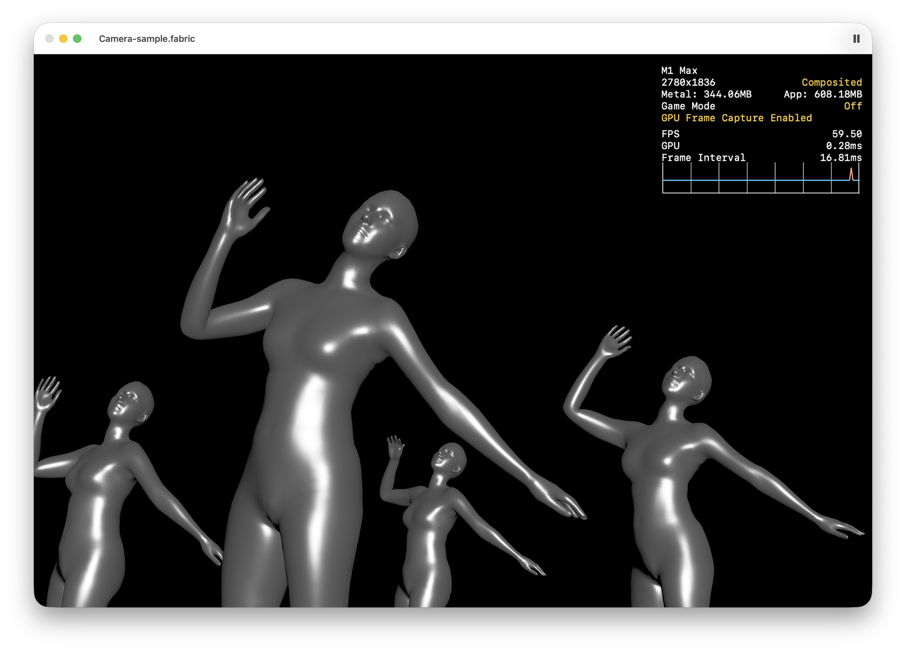

# Body Mesh Provider



A macOS [Fabric](https://github.com/Fabric-Project/Fabric) plug-in that reads
body-mesh assets generated by CMResearchKit and exposes them as time-varying
Satin geometry.

The plug-in provides the `Body Mesh Provider` geometry node and a `Body Mesh
Intrinsic Camera` node that reproduces the generator app's source-camera
framing.

## Body Mesh Provider

**Body Mesh Provider** is a time-based geometry node that reads a prepared
body-mesh asset folder created by the generator app. Select the folder—not its
individual `frames.bin` file—from the node's Settings panel. The panel validates
the asset and reports its native frame rate, frame count, duration, and any
loading error.

The node reconstructs the requested archive frame as Satin geometry that can be
connected to Fabric's existing Mesh node and material system. It follows graph
time by default. Connect the **Time** input to use an external clock, or adjust
**Playback Rate** to speed up, slow down, or reverse graph-time playback.

Use **Confidence** to reject uncertain detections and **Maximum Bodies** to
limit how many of the highest-confidence people are included. Selected bodies
are combined into one geometry; the archive does not provide stable person
identities across frames.

Along with **Geometry**, the node reports detected and output body counts,
current frame, native frame rate, frame count, duration, frame availability,
and source dimensions. The **Source Size** output can drive Body Mesh Intrinsic
Camera when source-matched framing is desired.

## Body Mesh Intrinsic Camera

**Body Mesh Intrinsic Camera** is an optional perspective-camera node designed
to reproduce the framing used by the body-mesh generator. Connect the Body Mesh
Provider's **Source Size** output to the camera's **Source Size** input.

The camera derives its field of view from the source dimensions and adjusts it
as the Fabric viewport changes. Its aspect-fit projection preserves the
generated mesh's original horizontal and vertical framing across different
output aspect ratios.

The camera defaults to the origin and looks along Fabric's negative Z axis,
matching the coordinate conversion performed by Body Mesh Provider. Position,
orientation, and scale remain available for creative adjustments.

This is a deterministic reconstruction of the generator's camera model. It
does not recover lens distortion, principal-point offsets, physical focal
length, or the original camera's position and orientation. Ordinary Fabric
cameras remain fully supported when source-matched framing is not required.

## Generate body mesh assets

[](https://www.youtube.com/watch?v=XR2QLn5UtyI)

Download the notarized arm64 generator app from the
[Body Mesh Provider 1.0 release](https://github.com/jvcleave/FabricBodyMeshProvider/releases/download/1.0/CMResearchKit-Example-1.0-arm64.dmg).
Use it to generate a body-mesh asset folder, then select that folder from the
Body Mesh Provider node's Settings panel in Fabric. The app requires macOS 15
or later on Apple silicon.

## Development layout

The default local layout is:

```text
MAC_APPS/
├── Fabric/
└── BodyMeshProvider/
```

The Xcode target builds against an adjacent checkout of the
[Fabric repository](https://github.com/Fabric-Project/Fabric). Override its
location with the `FABRIC_SOURCE_ROOT` build setting when necessary.

## Build and install

Open `BodyMeshProvider/BodyMeshProvider.xcodeproj` and build the
`BodyMeshProvider` scheme, or run:

```sh
xcodebuild \
  -project BodyMeshProvider/BodyMeshProvider.xcodeproj \
  -scheme BodyMeshProvider \
  -configuration Debug \
  -destination 'platform=macOS' \
  build
```

The build prepares the matching Fabric Swift module, builds the plug-in, copies
the constants into its resources, installs it at the path below, and ad-hoc
signs the installed bundle:

```text
~/Library/Application Support/Fabric/Plugins/BodyMeshProvider.fabricplugin
```

Use the same build configuration for Fabric Editor and the plug-in. Restart
Fabric Editor after rebuilding because Fabric discovers plug-ins when its node
registry starts.

## Use in Fabric

### Included sample

Open [`FabricScenes/Sample.fabric`](FabricScenes/Sample.fabric) for a basic
working scene. The scene's sample asset is included at
[`FabricScenes/947B44F8-C4C3-4666-93B5-73BD71CE231A`](FabricScenes/947B44F8-C4C3-4666-93B5-73BD71CE231A),
but Fabric stores selected folders as absolute URLs. After cloning the
repository, re-link it once:

1. Select the **Body Mesh Provider** node in the sample scene.
2. Open its Settings and choose **Choose Asset Folder**.
3. Select the included `FabricScenes/947B44F8-C4C3-4666-93B5-73BD71CE231A`
   folder—not its individual `frames.bin` file.

### Four-body camera sample

For a more representative intrinsic-camera example, download and expand
[`C00F9E45-6C83-4760-A700-BBF2A37D0380.zip`](https://github.com/jvcleave/FabricBodyMeshProvider/releases/download/1.0/C00F9E45-6C83-4760-A700-BBF2A37D0380.zip),
then open [`FabricScenes/Camera-sample.fabric`](FabricScenes/Camera-sample.fabric).
Select its **Body Mesh Provider** node and re-link the asset folder to the
expanded `C00F9E45-6C83-4760-A700-BBF2A37D0380` directory.

The scene connects **Source Size** to **Body Mesh Intrinsic Camera** and sets
**Maximum Bodies** to `4`, allowing all four performers in the sample to be
included when their confidence passes the node's threshold.

### Build a scene manually

To build a scene manually:

1. Add **Body Mesh Provider** from the Geometry node group.
2. Open the node's Settings and choose an output folder created by the generator
   app.
   The panel reports compatibility, native frame rate, frame count, duration,
   and any loading error. Use **Reload** after repairing an asset in place.
3. Connect **Geometry** to Fabric's existing Mesh node, then attach a material
   and render it normally.
4. Use graph time for ordinary playback, or connect **Time** to make an external
   clock authoritative.
5. For source-camera framing, add **Body Mesh Intrinsic Camera** and connect the
   provider's **Source Size** output to its **Source Size** input. The camera
   becomes the graph's active camera using Fabric's usual last-added-camera
   behavior.

The node exposes Loop, Playback Rate, Confidence, and Maximum Bodies controls,
plus body count, frame rate, frame count, duration, frame availability, and
source-size metadata.

## Tests

The core package has no Fabric, Satin, SwiftUI, or CMResearchKit dependency:

```sh
swift test --package-path BodyMeshProviderCore
```

The checked-in example asset is always exercised. Additional local archives
under `SampleData` are exercised when present and remain ignored by Git.
